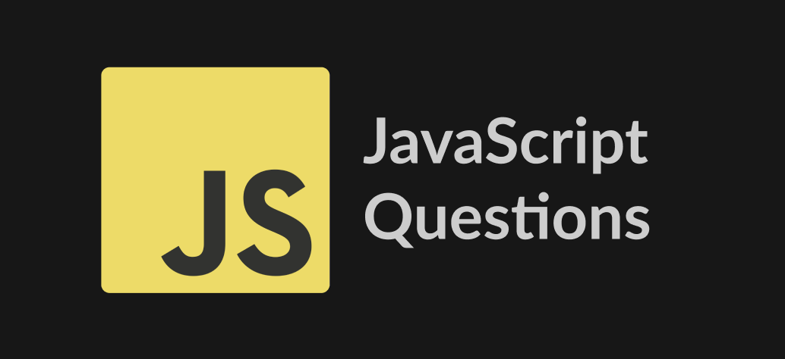

# JavaScript Solutions



** Image credits: [Lydia Hallie](https://github.com/lydiahallie) **

This repository contains solutions to a variety of JavaScript problems. These solutions were inspired by a LinkedIn post by [Author Name] with a collection of 21 JavaScript interview questions. Due to the number of questions, I've split the solutions across two Medium articles:

- [Medium Article 1 Title]([link to your first medium article])
- [Medium Article 2 Title]([link to your second medium article])

## Original LinkedIn Post

- [Post by Alpana P.](https://www.linkedin.com/posts/alpnap_javascript-interview-activity-7230078341645500416-dmJz)

## Code Snippets

The repository includes the following JavaScript functions:

- `findLongestWord`
- `isPalindrome`
- `removeDuplicates`
- `reverseString`
- `findMaxConsecutiveOnes`
- `factorial`
- `mergeSortedArrays`
- `correspondingSquare`
- `otherStringFromFirst`
- `uniqueObjectsFromArray`
- `maxNumberInArray`
- `onlyEvenNumbers`
- `isPrime`
- `largestElementInNestedArray`
- `fibonacciTillNumber`
- `countOccurrences`
- `sortAscending`
- `sortDescending`
- `reverseWords`
- `flattenArray`
- `convertStringToObj`

Feel free to explore the code and the corresponding Medium articles for detailed explanations and insights into each solution.

## To Run the Code

1. Clone the repository:

```bash
git clone
```

2. Navigate to the project directory:

```bash
cd javascript-solutions
```

3. Install the dependencies:

```bash
npm install
```

4. Play around, test the functions, and explore the code!

5. Run the tests:

```bash
npm test
```

## Contributions

Contributions and improvements to the code are welcome! If you have a better solution or want to add more examples, feel free to open a pull request.
# js-solutions
